# Production Release Governance

A centralized governance system for production deployments that ensures compliance, creates audit trails, and prevents unauthorized releases. Designed for service delivery teams to maintain control while enabling developer self-service.

## 🎯 Business Value

### For Service Delivery Teams
- **Compliance Control**: Every production deployment is gated and audited
- **Risk Management**: Clear separation between low-risk and high-risk changes
- **Audit Trails**: Permanent records of who deployed what, when, and why
- **Change Control**: Major releases require approved change requests
- **Self-Service**: Developers can deploy safely without manual approvals for minor changes

### For Development Teams
- **Speed**: Minor releases deploy immediately after governance check
- **Clarity**: Simple 2-question impact assessment
- **Transparency**: Clear requirements for major vs minor releases
- **Automation**: No manual paperwork or ticket creation

## 📋 How It Works - Service Delivery Perspective

### 1. Developer Self-Assessment
Developers answer two simple questions before any production deployment:
- **Does this change cause downtime?** (Yes = Major Release)
- **Does this change affect PII data?** (Yes = Major Release)

**[SCREENSHOT NEEDED: GitHub workflow dispatch form showing the 4 input fields]**

### 2. Automated Governance Decision

**Minor Release (Low Risk)**
- Both questions answered "No"
- ✅ Proceeds immediately to deployment
- 📧 Automatic notification prepared for ServiceNow integration
- 📋 Audit record created and stored

**Major Release (High Risk)**  
- Either question answered "Yes"
- 🛑 **BLOCKS deployment** until approved Change Request provided
- ✅ Only proceeds with valid CR number
- 📋 Enhanced audit record with CR tracking

**[SCREENSHOT NEEDED: GitHub Actions workflow showing governance check step passing/failing]**

### 3. Deployment & Audit Trail

**[SCREENSHOT NEEDED: Successful deployment showing version bump and audit artifact]**

Every deployment automatically:
- Creates permanent audit record (JSON format)
- Stores in GitHub artifacts (6-month retention)
- Includes complete traceability information
- Prepares ServiceNow notification data

## 🔒 Governance Controls

### Impact Assessment Questions

| Question | Minor Release | Major Release | Action |
|----------|---------------|---------------|---------|
| Causes downtime? | ❌ No | ✅ Yes | **BLOCK** until CR provided |
| Affects PII data? | ❌ No | ✅ Yes | **BLOCK** until CR provided |
| Tests verified? | ✅ Required | ✅ Required | **BLOCK** if not confirmed |

### Change Request Validation
- Major releases **cannot proceed** without approved CR number
- System validates CR format and presence
- CR number recorded in all audit trails
- Links deployment back to approved change

**[SCREENSHOT NEEDED: Failed major release showing "CR number required" error]**

## 📊 Audit & Reporting

### Automatic Audit Records
Every deployment creates a structured JSON record containing:

```json
{
  "release_type": "minor",
  "deployed_by": "john.doe",  
  "timestamp": "2024-08-27 14:30:15 UTC",
  "commit": "abc123def456",
  "downtime": false,
  "pii_changes": false,
  "tests_verified": true,
  "change_request": "",
  "repository": "team-x/frontend-app",
  "workflow": "Production Release",
  "run_id": "1234567890",
  "run_url": "https://github.com/team-x/frontend-app/actions/runs/1234567890"
}
```

**[SCREENSHOT NEEDED: GitHub artifacts showing governance-record.json download]**

### Compliance Reporting
- All records stored for 6 months in GitHub
- Downloadable for compliance audits  
- Full traceability from deployment back to code changes
- Integration ready for ServiceNow/ITSM systems

## 🏢 Organizational Implementation

### For Service Delivery Managers

**Deployment Control Matrix:**
- **Minor releases**: Developer self-service with automatic audit
- **Major releases**: Requires approved Change Request (your existing process)
- **Emergency releases**: Use existing emergency change process

**Risk Mitigation:**
- No deployments bypass governance checks
- All changes classified and recorded
- Clear audit trail for all releases
- ServiceNow integration maintains ITSM process

### Rollout Strategy

1. **Pilot Phase**: Deploy to 2-3 development teams
2. **Integration**: Connect ServiceNow webhook for notifications  
3. **Rollout**: Mandatory for all production deployments
4. **Monitoring**: Review audit reports and adjust governance rules

**[SCREENSHOT NEEDED: GitHub repository Actions tab showing multiple successful governance workflows]**

## 🛠️ Technical Implementation

### For Development Teams



```mermaid
flowchart LR
    Start([Production Release 👤]) --> RunTests[Run All Tests 🖥️]
    
    RunTests -->|Tests Fail| StopFail[❌ Block Release 🖥️]
    RunTests -->|Tests Pass| CheckDowntime{Has Downtime? 🖥️}
    
    CheckDowntime -->|No| CheckPII{PII Changes? 🖥️}
    CheckDowntime -->|Yes| InputCR[Input Change Request # 👤]
    
    CheckPII -->|No = Minor| Deploy[🚀 Deploy to Production 🖥️]
    CheckPII -->|Yes = Major| InputCR
    
    InputCR --> DeployMajor[🚀 Deploy to Production 🖥️]
    
    Deploy --> EmailSNOW[📧 Email ServiceNow 🖥️]
    DeployMajor --> Verify[✅ Verify Deployment 🖥️]
    EmailSNOW --> Verify
    Verify -->|Success| Complete[✅ Release Complete 🖥️]
    Verify -->|Failed| Rollback[🔄 Rollback 👤]

    %% Style definitions
    classDef start fill:#9ff, stroke:#0c9, stroke-width:2px;
    classDef process fill:#fff, stroke:#999, stroke-width:1px;
    classDef decision fill:#ffd, stroke:#db0, stroke-width:2px;
    classDef success fill:#cfc, stroke:#0c0, stroke-width:2px;
    classDef danger fill:#fcc, stroke:#c00, stroke-width:2px;
    
    %% Classifications
    class Start start;
    class RunTests,Deploy,DeployMajor,EmailSNOW,Verify process;
    class CheckDowntime,CheckPII decision;
    class Complete success;
    class StopFail,InputCR,Rollback danger;
    
    %% Legend
    subgraph Legend
        GitHubProc[🖥️ GitHub Actions]
        ManualProc[👤 Manual Process]
    end
```

## 🛠️ Usage

### Basic Setup

Add this to your `.github/workflows/release.yml`:

```yaml
name: Production Release

on:
  workflow_dispatch:
    inputs:
      downtime:
        description: 'Does this change cause downtime?'
        type: boolean
        required: true
        default: false
      pii_changes:
        description: 'Does this change affect PII data?'
        type: boolean
        required: true
        default: false
      change_request:
        description: 'Change Request # (required if major release)'
        type: string
        required: false
        default: ''

jobs:
  release:
    runs-on: ubuntu-latest
    
    steps:
    - name: Checkout code
      uses: actions/checkout@v4
    
    - name: Run Production Release
      uses: your-org/release-action@v1
      with:
        downtime: ${{ github.event.inputs.downtime }}
        pii-changes: ${{ github.event.inputs.pii_changes }}
        change-request: ${{ github.event.inputs.change_request }}
        deploy-command: |
          # Add your deployment commands here
          docker build -t myapp:${{ github.sha }} .
          kubectl set image deployment/myapp myapp=myapp:${{ github.sha }}
        servicenow-webhook: ${{ secrets.SERVICENOW_EMAIL_WEBHOOK }}
```

### Required Secrets

Add to your repository settings:
```
SERVICENOW_EMAIL_WEBHOOK=https://your-servicenow-instance.com/webhook
```

## 📋 How to Deploy

1. **Go to Actions tab** in your repository
2. **Click "Production Release"** workflow
3. **Click "Run workflow"** button
4. **Answer the questions**:
   - ✅ Does this change cause downtime?
   - ✅ Does this change affect PII data?
   - 📝 Enter Change Request # (if either above is Yes)
5. **Click "Run workflow"** - automation handles the rest!

## 🔄 Release Types

### Minor Releases ⚡
- **Criteria**: No downtime, no PII changes
- **Process**: Auto-deploy after tests pass
- **Approval**: None required

### Major Releases 🛡️
- **Criteria**: Has downtime OR affects PII data
- **Process**: Requires approved Change Request number
- **Approval**: Manual CR number input required

## 📧 ServiceNow Integration

Minor releases automatically notify ServiceNow via email webhook with:
- Release type (minor/major)
- Pull Request details
- Change Request number (for major releases)
- Deployment status

## ⚙️ Input Parameters

| Input | Description | Required | Default |
|-------|-------------|----------|---------|
| `downtime` | Does this change cause downtime? | ✅ | - |
| `pii-changes` | Does this change affect PII data? | ✅ | - |
| `change-request` | Change Request # (required for major) | ❌ | - |
| `deploy-command` | Command to deploy to production | ✅ | - |
| `servicenow-webhook` | ServiceNow email webhook URL | ✅ | - |
| `node-version` | Node.js version to use | ❌ | `18` |
| `test-command` | Command to run tests | ❌ | `npm test` |
| `install-command` | Command to install dependencies | ❌ | `npm ci` |
| `verify-command` | Command to verify deployment | ❌ | `echo "✅ Deployment verified"` |
| `rollback-command` | Command to rollback on failure | ❌ | `echo "🔄 Rollback initiated"` |

## 📤 Outputs

| Output | Description |
|--------|-------------|
| `release-type` | Type of release (`minor` or `major`) |
| `change-request` | Change request number (for major releases) |
| `deployment-status` | Deployment status (`success` or `failed`) |

## 🚨 Failure Handling

- **Test Failures**: Block release entirely
- **Deployment Failures**: Automatic rollback initiated
- **Missing CR Numbers**: Major releases blocked until provided

## 📋 Deployment Records

Every successful deployment creates a **GitHub Release** with complete audit trail:

- 🏷️ **Release Tag**: `deploy-YYYYMMDD-HHMMSS`
- 📝 **Release Notes**: Include all deployment details
- 📧 **ServiceNow Messages**: Full notification content (for minor releases)
- ✅ **Impact Assessment**: Downtime/PII decisions recorded
- 🔗 **Traceability**: Links to commits, workflows, and change requests

Example release notes:
```markdown
## Production Deployment Record

**Release Type:** minor
**Deployed by:** john.doe
**Timestamp:** 2024-08-22 14:30:15 UTC
**Commit:** abc123def456

### Impact Assessment
- **Downtime:** false
- **PII Changes:** false

### ServiceNow Notification
The following message was sent to ServiceNow:
[Full notification content...]
```

## 📁 File Structure

```
.github/
└── workflows/
    └── release.yml             # Manual trigger workflow
action.yml                      # Reusable action
```

## 🎯 Benefits

- ✅ **Compliance**: Automatic ServiceNow tracking
- ⚡ **Speed**: Minor releases deploy instantly
- 🛡️ **Safety**: Major changes require explicit approval
- 🔄 **Reliability**: Built-in testing and rollback
- 📊 **Visibility**: Clear audit trail

---

*Built with GitHub Actions for streamlined production deployments*# test-dispatch-check
